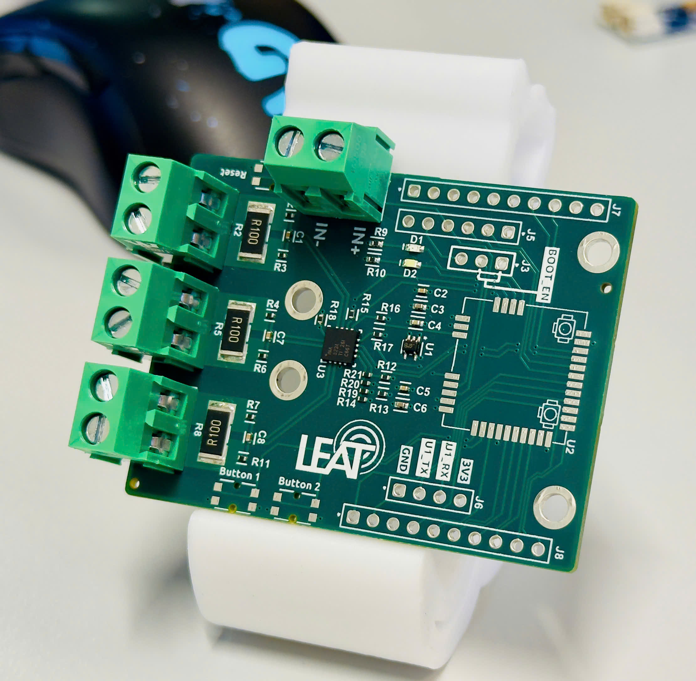

# LoRa PWR Monitor Board

Welcome to the **LoRa PWR Monitor Board** repository!  

This repository contains:
- `./pcb/`: PCB design(s)
- `./src/`: Source code
- `./docs/`: Documentation  

## Purpose

The **LoRa PWR Monitor Board** is designed to measure power consumption, specifically **current** and **voltage**, for IoT devices in real-world deployments. It can be used to monitor power sources like:
- Solar panels
- Batteries
- Battery chargers
- Device-under-test setups  

### Key Features

- Supports up to **three simultaneous measuring sources**.
- Utilizes the **RAKwireless RAK11720** for **LoRa/LoRaWAN** and **BLE connectivity**.
- Leverages the **TI INA3221AIRGVR IC** for accurate current sensing.

## Getting Started

To get started, check out the documentation folder for setup instructions and examples.  

## Contributions

Contributions are welcome! Feel free to open issues or submit pull requests for improvements, bug fixes, or feature additions.  

---

Thank you for your interest in the **LoRa PWR Monitor Board**. If you have any questions, don't hesitate to reach out!

### Rev100 Prototype

---
